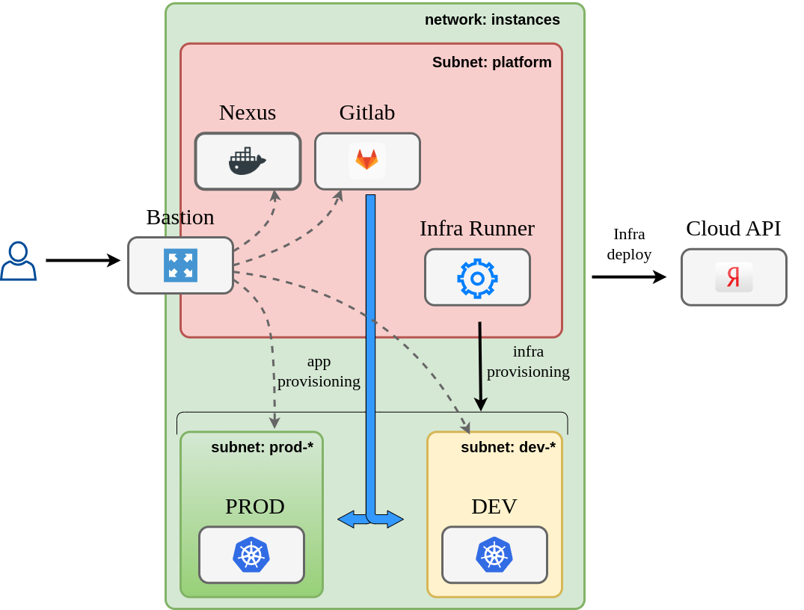

# Цель работы

Цель этой работы - демонстрация навыков работы с инструментами деплоя приложений в облачной инфраструктуре. В качестве облака выбрана платформа Yandex.Cloud, в качестве приложения для деплоя выбрано микросервисный демо-интернет-магазин [microservices-demo](https://github.com/microservices-demo/microservices-demo).
Данный проект является учебным, призванным продемонстрировать работу с типовыми инструментами деплоя, поэтому использование их зачастую не является оптимальным. Например:
- для демонстрации процесса развертывания установки кластеров kubernetes используется kubespray, хотя платформа Yandex.Cloud позволяет использовать [managed-kubernetes](https://cloud.yandex.ru/services/managed-kubernetes)
- количество окружений сведено к минимуму (`dev` и `prod`).
- сервисы используются в минимальной конфигурации.

# Задача

В компании существует восемь команд программистов, каждая из которых занимается разработкой микросервиса, реализующего определенную функцию интернет-магазина с названием `boutique`. На текущем этапе для тестирования и сборки микросервисов требуется один `dev` kubernetes-кластер, а для работы интернет-магазина требуется второй `prod` kubernetes-кластер. В дальнейшем количество окружений существенно вырастет, поэтому требуется автоматизировать процесс их развертывания.

# Общее решение

Решение можно разбить на три части: 
- деплой инфраструктуры (управление ресурсами)
- сборка микросервисов
- деплой решения

## Управление инфраструктурой

Для управления инфраструктурой необходимо развернуть `gitlab`, `runner` и `nexus`. 

`gitlab` будет выступать оркестратором всех процессов CI/CD, а также хранилищем исходного кода, конфигураций и секретов.

`nexus` будет выступать хранилищем бинарных файлов (образов контейнеров).

Для управления инфраструктурой будет использоваться `terraform`, `ansible`, `docker` и `helm`.

Запуск пайплайна по обновлению инфраструктуры (установке кластеров) будет производиться на хосте `runner` - обычном docker-инстансе.

## Сборка микросервисов

У каждой команды будет свой репозиторий, в котором должна быть настроена следующая логика сборки.
При коммите в дефолтную ветку (`main` или `master`) должна происходить сборка из докерфайла и пуш в репозиторий для снапшотов, где образ будет храниться несколько дней для тестирования или демонстрации, после чего он будет удален.
При создании тэга (версии) будет происходить сборка из докерфайла и пуш в релизный репозиторий.
Сборка будет производиться на `dev` кластере.


## Деплой решения

Для деплоя решения необходимо создать выделенный репозиторий, в котором будет храниться конфигурация деплоя (helm chart и values). При коммите в дефолтную ветку должен производиться деплой в `prod` кластер.


## Инфраструктура

### Сетевая архитектура



В проекте используется одна сеть, разделенная на несколько подсетей. В минимальной конфигурации таких подсетей требуется пять:

- `platform` - подсеть для размещения депломент-инфраструктуры (`nexus`, `gitlab`, `gitlab-runner`)
- `dev-a`, `dev-b` - подсети для размещения development кластера, в целях отказоусточивости подсети размещены в двух разных зонах доступности.
- `prod-a`, `prod-b` - подсети для размещения production кластера, в целях отказоусточивости подсети размещены в двух разных зонах доступности.

Выход в интернет организован через [NAT gateway](https://cloud.yandex.ru/docs/vpc/concepts/gateways#nat-gateway).
Доступ к хостам в подсетях ограничивается с помощью [security groups](https://cloud.yandex.ru/docs/vpc/concepts/security-groups). С помощью security groups можно также ограничить выход в интернет.

Доступ в сеть проекта осуществляется через `bastion` - единственный хост во всем проекте, имеющий публичный IP-адрес.
Деплой сетевой инфраструктуры осуществляется с помощью `terraform`.

### Хосты

- `bastion` - хост для удаленного доступа к проекту в yandex.cloud, используется как SSH-туннель и SOCKS5-прокси-сервер для доступа к остальным хостам.
- `nexus`  - репозиторий образов контейнеров;
- `gitlab` - оркестратор операций деплоя;
- `docker` - среда для запуска runner-агентов для `gitlab`;

Все вышеперечисленные хосты размещаются в подсети `platform`.
Хосты кластеров kubernetes размещаются в выделенных для этого подсетях. Каждый кластер (в целях экономии бюджета) состоит из двух рабочих нод и одного мастера.

## Описание окружений

Конфигурация окружений хранится в папке [infrastructure/envs](infrastructure/envs/). Для каждого окружения выделена подпапка, в которой находится файл `config.yml`, описывающий все необходимые настройки окружения. Файл содержит описание сети, хостов, шаблон для ansible-inventory, параметры деплоя раннера и мониторинга. Спецификация этого файла подробно описана [здесь](docs/config-specification.md)


## Builder-образ

Для деплоя окружений, а также для деплоя приложения в кластер, собран образ [builder](builder/Dockerfile). Этот образ содержит все необходимые утилиты (`ansible`,`helm`, `kubectl`, `terraform`, `yc`), а также набор необходимых модулей и скриптов.

# Установка

## Подготовка Yandex.Cloud

Запускаем скрипт [prerequisites.sh](prerequisites.sh), который создаcт необходимые объекты в Yandex.Cloud и вернет необходимые данные.

| Имя            | Дефолт | Описание     |
| :---            | :----:  |            :--- |
| folder | boutique | Каталог для размещения ресурсов |
| network | instances | Имя сети |
| Internet Gateway | default | Шлюз для выхода в интернет |
| Routing Table | routing | Таблица маршрутизации для сети |
| service-account | ${folder}-editor | имя сервисного аккаунта с правами деплоя |
| s3 bucket | ${folder}-tfstates | Бакет для хранения tf стейтов | 


## Подготовка переменных

1. Генерируем самоподписной wildcard сертификат для `*.ru-central1.internal` (см. [статью](docs/certificates-generating.md)). Этот домен используется внутри Yandex.Cloud, а сертификат будет использоваться для настройки https на хостах `gitlab` и `nexus`.
2. Генерируем ssh-key для доступа к нодам([инструкция](docs/ssh-keys-generating.md))
3. Вносим сгенерированные ключи, а также переменные, полученные при запуске `prerequisites.sh` в ansible-secret файл для `platform` окружения `./infrastructure/envs/env-platform/group_vars/all/secrets.yaml` и шифруем его.
Незашифрованный пример этого файла можно увидеть [в той же папке](infrastructure/envs/env-platform/group_vars/all/secrets.yaml.template)
4. Повторяем операцию для 
   - dev окружения ([template](infrastructure/envs/env-dev/group_vars/all/secrets.yml.template))  
   - prod окружения ([template](infrastructure/envs/env-prod/group_vars/all/secrets.yml.template))  
  Здесь нужно внести только сгенерированный корневой сертификат. Не забываем зашифровать.

5. Создаем env-файл `builder/builder.env` по образцу из [builder.env.template](builder/builder.env.template) и заполняем его значениями, полученными на предыдущих этапах.

## Сборка и запуск образа

1. Собираем образ `builder` командой
   
   ```
   docker build --no-cache ./builder/ -t builder
   ```

2. Запускаем `builder` контейнер на рабочей машине

   ```
   docker run \
        --rm \
        --env-file builder/builder.env \
        -v $(pwd)/infrastructure:/app/infrastructure \
        -v $HOME/ya_key.pub:/root/ya_key.pub \
        -v $HOME/ya_key:/root/ya_key \
        -v $(pwd)/boutique/components:/boutique \
        -ti builder
   ```
Здесь ya_key и ya_key.pub - это сгенерированный ssh-ключ.
__Проверка:__ контейнер должен запуститься.

## Деплой platform окружения

Все команды кроме последней в этом разделе выполняются в `builder` контейнере, запущенном на локальном хосте. На этом этапе мы установим `gitlab`, `nexus` и `runner`.

1. В запущенном контейнере выполняем команду `terraform_plan`, чтобы увидеть список ресурсов, которые будут созданы, после чего выполняем команду `terraform_apply`, которая **без дополнительных подтверждений** создаст описанные ресурсы.  
После создания список ресурсов можно посмотреть командами `yc_get_network`, `yc_get_instances`.
2. Настраиваем `bastion` хост командой `provision_bastion`. Эта команда установит все необходимые пакеты и сменит SSH-порт на 22322 (см. [bastion group_vars](infrastructure/envs/env-platform/group_vars/bastion/main.yml))
3. Добавляем переменную `ANSIBLE_SSH_COMMON_ARGS`, чтобы ansible работал через настроенный `bastion` хост. IP-адрес хоста можно получить командой `yc_get_instances`
   ```
    BASTION_IP=x.x.x.x
    export ANSIBLE_SSH_COMMON_ARGS='-o StrictHostKeyChecking=no -o ProxyCommand="ssh -W %h:%p -q ubuntu@'${BASTION_IP}' -p 22322"'
   ```
4. Запускаем команду `provision_misc`. Эта команда обновит пакеты на всех установленных хостах, а также добавит доверенные сертификаты.
5. Запускаем команду `provision_nexus` для настройки Nexus CE ([nexus group_vars](infrastructure/envs/env-platform/group_vars/nexus/main.yml))
6. Запускаем `provision_gitlab` для установки Gitlab CE ([gitlab group_vars](infrastructure/envs/env-platform/group_vars/gitlab/main.yml)).
7. **Эта команда выполняется на локальной машине.** Для доступа внутрь развернутого окружения к веб-интерфейсам `gitlab` и `nexus` нужно использовать `bastion` в качестве SOCKS5-proxy ([больше информации](docs/bastion-configuration.md)). Для этого нужно выполнить следующую команду:    
  ```  
  ssh -D 1337 -f -C -q -N ubuntu@<BASTION_IP> -p 22322  
  ```  
  Далее необходимо прописать в браузере SOCKS5-прокси localhost:1337, после чего станут доступны веб-интерфейсы 
- `gitlab` - http://gitlab11.ru-central1.internal/
- `nexus` - https://nexus11.ru-central1.internal/

__Проверка:__ проверить в браузере доступность интерфейсов.

## Настройка репозиториев и раннера

Операции в этом разделе выполняются в `builder` контейнере.

1. Запускаем команду `provision_infra_repo`. Эта команда скопирует текущий репозиторий в `gitlab`, а также создаст репозиторий с конфигурацией остальных окружений для деплоя.
2. Запускаем команду `provision_apps_repo`. Эта команда создаст репозитории, содержащие исходный код микросервисов, а также репозиторий деплоя в `prod` кластер.
3. Запускаем команду `provision_infra_runner`. Эта команда создаст раннер и подключит его к `giltab`.
4. Зайти в репозиторий `infrasctructure/build-stack` и сделать любой коммит в папку `./builder`. Это запустит пайплайн, который соберет `builder` image и запушит его в `nexus`ю
__Проверка:__ открыть интерфейс `gitlab` и проверить наличие репозиториев:
- infrasctructure/build-stack
- infrastructure/envs
- boutique/carts
- boutique/catalogue
- boutique/front-end
- boutique//orders
- boutique/payment
- boutique/queue-master
- boutique/shipping
- boutique/user
- release/release-prod
__Проверка:__ открыть `nexus` и проверить наличие образа `builder`
