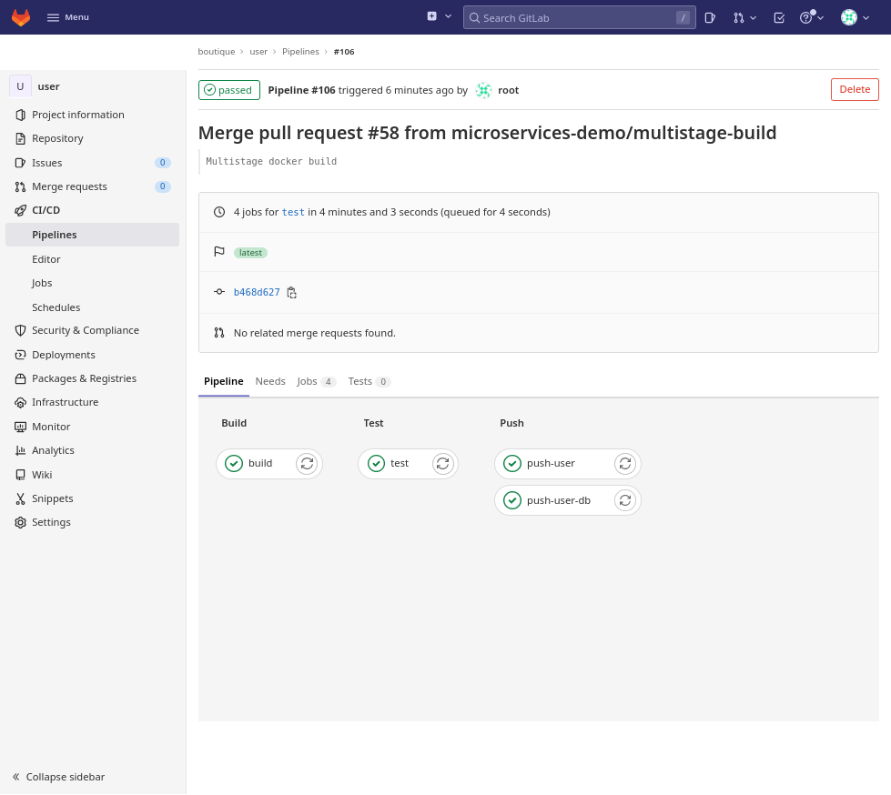

## Оглавление
- [Цель работы](#цель-работы)
- [Задача](#задача)
- [Общие принципы решения](#общие-принципы-решения)
  - [Управление инфраструктурой](#управление-инфраструктурой)
  - [Сборка микросервисов](#сборка-микросервисов)
  - [Деплой решения](#деплой-решения)
  - [Инфраструктура](#инфраструктура)
    - [Сетевая архитектура](#сетевая-архитектура)
    - [Хосты](#хосты)
    - [Kubernetes кластера](#kubernetes-кластера)
    - [Мониторинг](#мониторинг)
  - [Описание окружений](#описание-окружений)
  - [Builder-образ](#builder-образ)
- [Установка](#установка)
  - [Подготовка Yandex.Cloud](#подготовка-yandexcloud)
  - [Подготовка переменных](#подготовка-переменных)
  - [Сборка и запуск образа](#сборка-и-запуск-образа)
  - [Деплой platform окружения](#деплой-platform-окружения)
  - [Настройка репозиториев и docker-runner](#настройка-репозиториев-и-docker-runner)
  - [Установка dev и prod окружений](#установка-dev-и-prod-окружений)
  - [Сборка микросервисов](#сборка-микросервисов-1)
  - [Деплой решения](#деплой-решения-1)
- [Удаление окружений](#удаление-окружений)

# Цель работы

Цель этой работы - демонстрация навыков работы с инструментами деплоя приложений в облачной инфраструктуре. В качестве облака выбрана платформа Yandex.Cloud, в качестве приложения для деплоя выбрано микросервисный демо-интернет-магазин [microservices-demo](https://github.com/microservices-demo/microservices-demo).
Данный проект является учебным, призванным продемонстрировать работу с типовыми инструментами деплоя, поэтому использование их зачастую не является оптимальным. Например:
- для демонстрации процесса развертывания установки кластеров kubernetes используется kubespray, хотя платформа Yandex.Cloud позволяет использовать [managed-kubernetes](https://cloud.yandex.ru/services/managed-kubernetes)
- количество окружений сведено к минимуму (`dev` и `prod`).
- сервисы используются в минимальной конфигурации
- application load balancer не использует HTTPS 
- скачивание большинства пакетов происходит из публичных репозиториев, лишь для docker-образов реализована схема с проксирующим репозиторием
- для компиляции приложений не используется кэширование
- используется один docker-образ для всех задач, что негативно на скорости его загрузки

# Задача

В компании на проекте с названием `boutique` работает восемь команд программистов, каждая из которых занимается разработкой микросервиса, реализующего определенную функцию интернет-магазина. На текущем этапе им требуется два kubernetes-кластера:
- `dev` - кластер для тестирования и сборки микросервисов  
- `prod` - кластер для работы интернет-магазина. 
 
В дальнейшем количество окружений существенно вырастет, поэтому требуется автоматизировать процесс их развертывания.

# Общие принципы решения

Решение можно разбить на три части: 
- деплой инфраструктуры (управление ресурсами)
- сборка микросервисов
- деплой решения

## Управление инфраструктурой

Для управления инфраструктурой необходимо развернуть `gitlab`, `runner` и `nexus`. `gitlab` будет выступать оркестратором всех процессов CI/CD, а также хранилищем исходного кода, конфигураций и секретов. `nexus` будет выступать хранилищем бинарных файлов (образов контейнеров). Для управления инфраструктурой будет использоваться `terraform`, `ansible`, `docker` и `helm`. Запуск пайплайна по обновлению инфраструктуры (установке кластеров) будет производиться на хосте `runner` - обычном docker-инстансе.  


## Сборка микросервисов

У каждой команды будет свой репозиторий, в котором должна быть настроена следующая логика сборки.
При коммите в дефолтную ветку `master` должна происходить сборка из докерфайла и пуш в репозиторий для снапшотов, где образ будет храниться 24 часа для тестирования или демонстрации, после чего он будет автоматически удален.
При создании тэга (версии) будет происходить сборка из докерфайла и пуш в релизный репозиторий.
Сборка будет производиться на `dev` кластере.
В исходных репозиториях уже есть сборка с помощью `github actions` и `docker`, в проекте этот процесс реализован с помощью `kaniko` и/или `dind`.


## Деплой решения

Для деплоя решения необходимо создать выделенный репозиторий, в котором будет храниться конфигурация деплоя (helm chart и values). При коммите в дефолтную ветку должен производиться деплой в `prod` кластер.


## Инфраструктура

### Сетевая архитектура


В проекте используется одна сеть, разделенная на несколько подсетей. В минимальной конфигурации таких подсетей требуется пять:

- `platform` - подсеть для размещения депломент-инфраструктуры (`nexus`, `gitlab`, `gitlab-runner`)
- `dev-a`, `dev-b` - подсети для размещения development кластера, в целях отказоусточивости подсети размещены в двух разных зонах доступности.
- `prod-a`, `prod-b` - подсети для размещения production кластера, в целях отказоусточивости подсети размещены в двух разных зонах доступности.

Выход в интернет организован через [NAT gateway](https://cloud.yandex.ru/docs/vpc/concepts/gateways#nat-gateway).
Доступ к хостам в подсетях ограничивается с помощью [security groups](https://cloud.yandex.ru/docs/vpc/concepts/security-groups). С помощью security groups можно также ограничить выход в интернет.

Доступ в сеть проекта осуществляется через `bastion` - единственный хост во всем проекте, имеющий публичный IP-адрес.
Деплой сетевой инфраструктуры осуществляется с помощью `terraform`.

### Хосты

- `bastion` - хост для удаленного доступа к проекту в yandex.cloud, используется как SSH-туннель и SOCKS5-прокси-сервер для доступа к остальным хостам.
- `nexus`  - репозиторий образов контейнеров;
- `gitlab` - оркестратор операций деплоя;
- `docker` - среда для запуска runner-агентов для `gitlab`;

Все вышеперечисленные хосты размещаются в подсети `platform`.
Хосты кластеров kubernetes размещаются в выделенных для этого подсетях. Каждый кластер (в целях экономии бюджета) состоит из двух рабочих нод и одного мастера.

### Kubernetes кластера

Установка кластеров производится с помощью `ansible` и `kubespray`.

### Мониторинг

Мониторинг окружений осуществляется с помощью `prometheus`, который деплоится в кластер с помощью `helm`. Необходимость мониторинга и дополнительные настройки задаются в файле `config.yml` соответствующего окружения.

## Описание окружений

Конфигурация окружений хранится в папке [infrastructure/envs](infrastructure/envs/). Для каждого окружения выделена подпапка, в которой находится файл `config.yml`, описывающий все необходимые настройки окружения. Файл содержит описание сети, хостов, шаблон для ansible-inventory, параметры деплоя раннера и мониторинга. Спецификация этого файла подробно описана [здесь](docs/config-specification.md)


## Builder-образ

Для деплоя окружений, а также для деплоя приложения в кластер, собран образ [builder](builder/Dockerfile). Этот образ содержит все необходимые утилиты (`ansible`,`helm`, `kubectl`, `terraform`, `yc`), а также набор необходимых модулей и скриптов.

# Установка

## Подготовка Yandex.Cloud

Запускаем скрипт [prerequisites.sh](prerequisites.sh), который создаcт необходимые объекты в Yandex.Cloud и вернет необходимые данные.

| Имя            | Дефолт | Описание     |
| :---            | :----:  |            :--- |
| folder | boutique | Каталог для размещения ресурсов |
| network | instances | Имя сети |
| Internet Gateway | default | Шлюз для выхода в интернет |
| Routing Table | routing | Таблица маршрутизации для сети |
| service-account | ${folder}-editor | имя сервисного аккаунта с правами деплоя |
| s3 bucket | ${folder}-tfstates | Бакет для хранения tf стейтов | 


## Подготовка переменных

1. Генерируем самоподписной wildcard сертификат для `*.ru-central1.internal` (см. [статью](docs/certificates-generating.md)). Этот домен используется внутри Yandex.Cloud, а сертификат будет использоваться для настройки https на хостах `gitlab` и `nexus`.
2. Генерируем ssh-key для доступа к нодам([инструкция](docs/ssh-keys-generating.md))
3. Вносим сгенерированные ключи, а также переменные, полученные при запуске `prerequisites.sh` в ansible-secret файл для `platform` окружения `./infrastructure/envs/env-platform/group_vars/all/secrets.yaml` и шифруем его.
Незашифрованный пример этого файла можно увидеть [в той же папке](infrastructure/envs/env-platform/group_vars/all/secrets.yaml.template)
4. Повторяем операцию для 
   - dev окружения ([template](infrastructure/envs/env-dev/group_vars/all/secrets.yml.template))  
   - prod окружения ([template](infrastructure/envs/env-prod/group_vars/all/secrets.yml.template))  
  Здесь нужно внести только сгенерированный корневой сертификат. Не забываем зашифровать.

5. Создаем env-файл `builder/builder.env` по образцу из [builder.env.template](builder/builder.env.template) и заполняем его значениями, полученными на предыдущих этапах.

## Сборка и запуск образа

1. Собираем образ `builder` командой
   
   ```
   docker build --no-cache ./builder/ -t builder
   ```

2. Запускаем `builder` контейнер на рабочей машине

   ```
   docker run \
        --rm \
        --env-file builder/builder.env \
        -v $(pwd)/infrastructure:/app/infrastructure \
        -v $HOME/ya_key.pub:/root/ya_key.pub \
        -v $HOME/ya_key:/root/ya_key \
        -v $(pwd)/boutique/components:/boutique \
        -ti builder
   ```
Здесь ya_key и ya_key.pub - это сгенерированный ssh-ключ.

_Проверка:_ контейнер должен запуститься.

## Деплой platform окружения

Все команды кроме последней в этом разделе выполняются в `builder` контейнере, запущенном на локальном хосте. На этом этапе мы устанавливаем `gitlab`, `nexus` и `runner`.

1. В запущенном контейнере выполняем команду `terraform_plan`, чтобы увидеть список ресурсов, которые будут созданы, после чего выполняем команду `terraform_apply`, которая **без дополнительных подтверждений** создаст описанные ресурсы.  
После создания список ресурсов можно посмотреть с помощью команд `yc_get_network`, `yc_get_instances`.
2. Настраиваем `bastion` хост командой `provision_bastion`. Эта команда установит все необходимые пакеты и сменит SSH-порт на 22322 (см. [bastion group_vars](infrastructure/envs/env-platform/group_vars/bastion/main.yml))
3. Добавляем переменную `ANSIBLE_SSH_COMMON_ARGS`, чтобы ansible работал через настроенный `bastion` хост. IP-адрес хоста можно получить командой `yc_get_instances`
   ```
    BASTION_IP=x.x.x.x
    export ANSIBLE_SSH_COMMON_ARGS='-o StrictHostKeyChecking=no -o ProxyCommand="ssh -W %h:%p -q ubuntu@'${BASTION_IP}' -p 22322"'
   ```
4. Запускаем команду `provision_misc`. Эта команда обновит пакеты на всех установленных хостах, а также добавит доверенные сертификаты.
5. Запускаем команду `provision_nexus` для настройки Nexus CE ([nexus group_vars](infrastructure/envs/env-platform/group_vars/nexus/main.yml))
6. Запускаем `provision_gitlab` для установки Gitlab CE ([gitlab group_vars](infrastructure/envs/env-platform/group_vars/gitlab/main.yml)).
7. **Эта команда выполняется на локальной машине.** Для доступа внутрь развернутого окружения к веб-интерфейсам `gitlab` и `nexus` нужно использовать `bastion` в качестве SOCKS5-proxy ([больше информации](docs/bastion-configuration.md)). Для этого нужно выполнить следующую команду:    
  ```  
  ssh -D 1337 -f -C -q -N ubuntu@<BASTION_IP> -p 22322  
  ```  
  Далее необходимо прописать в браузере SOCKS5-прокси localhost:1337, после чего станут доступны веб-интерфейсы 
- `gitlab` - http://gitlab11.ru-central1.internal/
- `nexus` - https://nexus11.ru-central1.internal/

_Проверка:_ проверить в браузере доступность интерфейсов.

## Настройка репозиториев и docker-runner

Операции в этом разделе выполняются в `builder` контейнере. Они создают необходимые репозитории в `gitlab` и добавляют необходимые переменные в gitlab CI Variables.

1. Запускаем команду `provision_infra_repo`. Эта команда скопирует текущий репозиторий в `gitlab`, а также создаст репозиторий с конфигурацией остальных окружений для деплоя.
2. Запускаем команду `provision_infra_runner`. Эта команда создаст раннер и подключит его к `giltab`.
3. Запускаем команду `provision_apps_repo`. Эта команда создаст репозитории, содержащие исходный код микросервисов, а также репозиторий деплоя в `prod` кластер.
4. Зайти в репозиторий `infrasctructure/build-stack` и сделать любой коммит в папку `./builder`. Это запустит пайплайн, который соберет `builder` image и запушит его в `nexus`.
   
_Проверка:_ открыть интерфейс `gitlab` и проверить наличие репозиториев:
- infrasctructure/build-stack
- infrastructure/envs
- boutique/carts
- boutique/catalogue
- boutique/front-end
- boutique//orders
- boutique/payment
- boutique/queue-master
- boutique/shipping
- boutique/user
- release/release-prod
  
_Проверка:_ открыть `nexus` и проверить наличие образа `infrastructure/builder`

_Проверка:_ открыть раздел CI/CD переменные для группы `infrastructure` в `gitlab` и проверить наличие переменных и их правильность.


## Установка dev и prod окружений

Шаги на этом этапе выполняются в `gitlab`. Адрес gitlab http://gitlab11.ru-central1.internal/
Пайплайн, использующийся для развертывания окружений, запускает тот же образ `builder` и те же команды из него, которые были использованы на этапе установки `platform` окружения. Переменные среды берутся из Gitlib CI Variables, куда были добавлены на предыдущем этапе.

1. Открываем настройки раннера для группы `boutique`, копируем токен, открываем переменные CI/CD в репозитории `infrastructure/envs` и устанавливаем переменную `RUNNER_TOKEN` для окружения `dev`.
2. Открываем репозиторий `infrastructure/envs` и создаем ветку `env-dev`.
3. Делаем коммит в `master` ветку, после чего создаем merge request (`MR`) в ветку `env-dev`. При создании `MR` выполнится pipeline, статус которого нужно проверить. Он должен вернуть список ресурсов (terraform plan), которые будут созданы.
4. Если список ресурсов правильный, то делаем merge `MR`. Merge запустит второй пайплайн, который выполнит `terraform apply`, затем произведет первоначальную настройку инстансов (обновит пакеты и добавит доверенные сертификаты), установит кластер с помощью `kubespray`, после чего с помощью `helm` задеплоит в него раннер и мониторинг.


5. Открыть `provision.k8s` в пайплайне и скачать из артефактов `kubeconfig`.
6. Отредактировать скачанный `kubeconfig`, добавив `clusters.cluster[0].proxy-url: socks5://localhost:1337` для подключения через `bastion` (см. [инфо](docs/bastion-configuration.md))
   
_Проверка:_ подключиться к кластеру и проверить его доступность.

Для деплоя `prod` кластера нужно проделать те же операции. `RUNNER_TOKEN` для `prod` кластера нужно брать из проекта `release/release-prod`.

## Сборка микросервисов

В проекте разрабатывается 10 микросервисов, исходный код которых находится в группе `boutique`. Когда очередная итерация разработки завершена, приложению присваивается версия, в репозитории создается тэг с этой версией, при создании которого стартует пайплайн.
Поскольку это тестовый проект и настоящих программистов здесь нет, то придется эмулировать этот процесс. Для этого открываем каждый репозиторий в группе `boutique` и выполняем следующее.
1. Переходим в раздел тэги
2. Находим последний созданный в репозитории тэг и создаем новый тэг `test` на тот же коммит



_Проверка:_ все пайплайны должны успешно выполниться, в `nexus` должно появиться 10 образов.


## Деплой решения

Деплой решения производится в `prod` кластер.

1. Открываем репозиторий `release/release-prod`
2. Указываем в файле `values.yaml` версии микросервисов, которые были собраны на предыдущем этапе.
3. Пушим изменения в `master`. Эта операция запустит пайплайн установки приложения в кластер.

_Проверка:_ все поды в кластере в статусе "Running"


_Проверка:_ приложение отвечает по адресу, указанному в ingress, а также работает весь основной функционал (каталог, заказы, кабинет пользователя)


# Удаление окружений

Для удаления окружений проще всего запустить `builder` контейнер на локальной машине, указав в переменной `ENV` файла `builder.env` нужное окружение и затем выполнив команду `terraform_destroy`