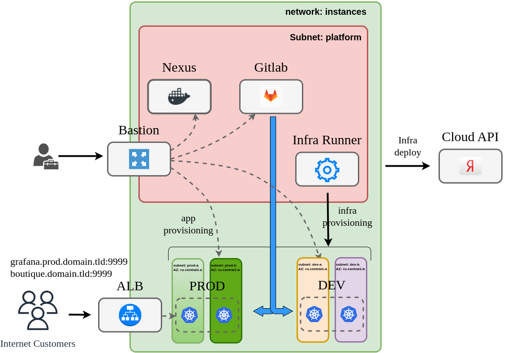
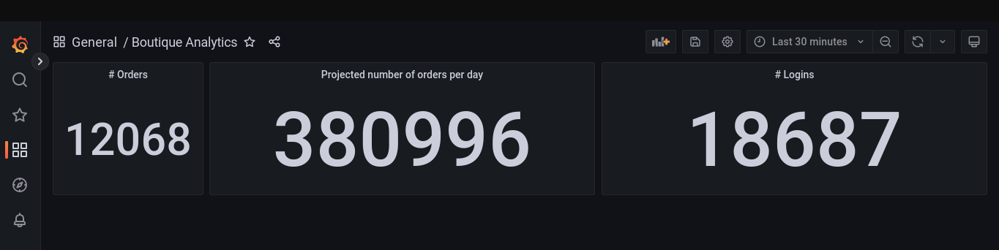

## Оглавление
- [Цель работы](#цель-работы)
- [Задача](#задача)
- [Общие принципы решения](#общие-принципы-решения)
  - [Управление инфраструктурой](#управление-инфраструктурой)
  - [Сборка микросервисов](#сборка-микросервисов)
  - [Деплой решения](#деплой-решения)
  - [Инфраструктура](#инфраструктура)
    - [Сетевая архитектура](#сетевая-архитектура)
    - [Сертификаты](#сертификаты)
    - [Хосты](#хосты)
    - [Kubernetes кластера](#kubernetes-кластера)
    - [Мониторинг](#мониторинг)
  - [Описание окружений](#описание-окружений)
  - [Builder-образ](#builder-образ)
- [Установка](#установка)
  - [Требования](#требования)
  - [Подготовка Yandex.Cloud](#подготовка-yandexcloud)
  - [Подготовка переменных](#подготовка-переменных)
  - [Сборка и запуск образа](#сборка-и-запуск-образа)
  - [Деплой platform окружения](#деплой-platform-окружения)
  - [Настройка репозиториев и docker-runner](#настройка-репозиториев-и-docker-runner)
  - [Установка dev и prod окружений](#установка-dev-и-prod-окружений)
  - [Сборка микросервисов](#сборка-микросервисов-1)
  - [Деплой решения](#деплой-решения-1)
  - [Нагрузочное тестирование и мониторинг](#нагрузочное-тестирование-и-мониторинг)
- [Удаление окружений](#удаление-окружений)
- [Итоги](#итоги)
  - [Облачная инфраструктура](#облачная-инфраструктура)
  - [Terraform](#terraform)
  - [CI/CD Platform](#cicd-platform)
  - [Приложение](#приложение)
  - [Деплой](#деплой)
- [Дополнительная информация](#дополнительная-информация)
  - [О расходах](#о-расходах)
  - [О публичных сертификатах и домене](#о-публичных-сертификатах-и-домене)
  - [Заметки](#заметки)

# Цель работы

Цель этой работы - демонстрация навыков работы с инструментами деплоя приложений в облачной инфраструктуре. В качестве облака выбрана платформа Yandex.Cloud, в качестве приложения для деплоя выбрано микросервисный демо-интернет-магазин [microservices-demo](https://github.com/microservices-demo/microservices-demo).
Данный проект является учебным, призванным продемонстрировать работу с типовыми инструментами деплоя, поэтому использование их зачастую не является оптимальным. Например:
- для демонстрации процесса развертывания установки кластеров kubernetes используется kubespray, хотя платформа Yandex.Cloud позволяет использовать [managed-kubernetes](https://cloud.yandex.ru/services/managed-kubernetes)
- количество окружений сведено к минимуму (`dev` и `prod`).
- сервисы используются в минимальной конфигурации
- application load balancer не использует HTTPS 
- скачивание большинства пакетов происходит из публичных репозиториев, лишь для docker-образов реализована схема с проксирующим репозиторием
- для компиляции приложений не используется кэширование
- используется один docker-образ для всех задач, что негативно на скорости его загрузки

# Задача

В компании на проекте с названием `boutique` работает восемь команд программистов, каждая из которых занимается разработкой микросервиса, реализующего определенную функцию интернет-магазина. На текущем этапе им требуется два kubernetes-кластера:
- `dev` - кластер для тестирования и сборки микросервисов  
- `prod` - кластер для работы интернет-магазина. 
 
В дальнейшем количество окружений существенно вырастет, поэтому требуется автоматизировать процесс их развертывания.

# Общие принципы решения

Решение можно разбить на три части: 
- деплой инфраструктуры (управление ресурсами)
- сборка микросервисов
- деплой решения

## Управление инфраструктурой

Для управления инфраструктурой необходимо развернуть `gitlab`, `runner` и `nexus`. `gitlab` будет выступать оркестратором всех процессов CI/CD, а также хранилищем исходного кода, конфигураций и секретов. `nexus` будет выступать хранилищем бинарных файлов (образов контейнеров). Для управления инфраструктурой будет использоваться `terraform`, `ansible`, `docker` и `helm`. Запуск пайплайна по обновлению инфраструктуры (установке кластеров) будет производиться на хосте `runner` - обычном docker-инстансе.  


## Сборка микросервисов

У каждой команды будет свой репозиторий, в котором должна быть настроена следующая логика сборки.
При коммите в дефолтную ветку `master` должна происходить сборка из докерфайла и пуш в репозиторий для снапшотов, где образ будет храниться 24 часа для тестирования или демонстрации, после чего он будет автоматически удален.
При создании тэга (версии) будет происходить сборка из докерфайла и пуш в релизный репозиторий.
Сборка будет производиться на `dev` кластере.
В исходных репозиториях уже есть сборка с помощью `github actions` и `docker`, в проекте этот процесс реализован с помощью `kaniko` и/или `dind`.


## Деплой решения

Для деплоя решения необходимо создать выделенный репозиторий, в котором будет храниться конфигурация деплоя (helm chart и values). При коммите в дефолтную ветку должен производиться деплой в `prod` кластер.


## Инфраструктура

### Сетевая архитектура



В проекте используется одна сеть, разделенная на несколько подсетей. В минимальной конфигурации таких подсетей требуется пять:

- `platform` - подсеть для размещения депломент-инфраструктуры (`nexus`, `gitlab`, `gitlab-runner`)
- `dev-a`, `dev-b` - подсети для размещения development кластера, в целях отказоусточивости подсети размещены в двух разных зонах доступности.
- `prod-a`, `prod-b` - подсети для размещения production кластера, в целях отказоусточивости подсети размещены в двух разных зонах доступности.

Выход в интернет организован через [NAT gateway](https://cloud.yandex.ru/docs/vpc/concepts/gateways#nat-gateway).
Для разграничения доступа к разным окружениям используются [security groups](https://cloud.yandex.ru/docs/vpc/concepts/security-groups). С помощью security groups можно также ограничить выход в интернет.

Доступ в сеть проекта осуществляется через `bastion` - единственный хост во всем проекте, имеющий публичный IP-адрес.
Доступ пользователей к сайту будет осуществляться через yandex-managed Application Load Balancer. 
Деплой сетевой инфраструктуры осуществляется с помощью `terraform`.

### Сертификаты

Сертификат для шифрования трафика (https) пользователей издаются через Certificate Manager. Валидация домена проводится с использованием процедуры [HTTP-01](https://letsencrypt.org/ru/docs/challenge-types/#%D0%BF%D1%80%D0%BE%D0%B2%D0%B5%D1%80%D0%BA%D0%B0-http-01).
Сертификат для внутренней dns-зоны `*.ru-central1.internal` самоподписной, генерируется по [инструкции](docs/certificates-generating.md) и используется для доступа к `nexus`.

### Хосты

- `bastion` - хост для удаленного доступа к проекту в yandex.cloud, используется как SSH-туннель и SOCKS5-прокси-сервер для доступа к остальным хостам.
- `nexus`  - репозиторий образов контейнеров;
- `gitlab` - оркестратор операций деплоя;
- `docker` - среда для запуска runner-агентов для `gitlab`;

Все вышеперечисленные хосты размещаются в подсети `platform`.
Хосты кластеров kubernetes размещаются в выделенных для этого подсетях. Каждый кластер (в целях экономии бюджета) состоит из двух рабочих нод и одного мастера.

### Kubernetes кластера

Установка кластеров производится с помощью `ansible` и `kubespray`.

### Мониторинг

Мониторинг окружений осуществляется с помощью `prometheus`, который деплоится в кластер с помощью `helm`. Необходимость мониторинга и дополнительные настройки задаются в файле `config.yml` соответствующего окружения. 
Для приложения реализовано три дашборда, отражающие бизнес-метрики и нагруженность приложения.

## Описание окружений

Конфигурация окружений хранится в папке [infrastructure/envs](infrastructure/envs/). Для каждого окружения выделена подпапка, в которой находится файл `config.yml`, описывающий все необходимые настройки окружения. Файл содержит описание сети, хостов, шаблон для ansible-inventory, параметры деплоя раннера и мониторинга. Спецификация этого файла подробно описана [здесь](docs/config-specification.md)


## Builder-образ

Для деплоя окружений, а также для деплоя приложения в кластер, собран образ [builder](builder/Dockerfile). Этот образ содержит все необходимые утилиты (`ansible`,`helm`, `kubectl`, `terraform`, `yc`), а также набор необходимых модулей и скриптов.

# Установка

## Требования

Для установки потребуется:
- аккаунт Yandex.Cloud
- публичный домен и доступ к DNS-зоне этого домена для валидации Let's Encrypt сертификатов. (можно обойтись без этого требования, см. [инструкцию](#о-публичных-сертификатах-и-домене))
- рабочая машина с установленными `git`, `docker`, `yc`, `jq`

## Подготовка Yandex.Cloud

Запускаем скрипт [prerequisites.sh](prerequisites.sh), который создаcт необходимые объекты в Yandex.Cloud и вернет необходимые данные.

| Имя            | Дефолт | Описание     |
| :---            | :----:  |            :--- |
| folder | boutique | Каталог для размещения ресурсов |
| network | instances | Имя сети |
| Internet Gateway | default | Шлюз для выхода в интернет |
| Routing Table | routing | Таблица маршрутизации для сети |
| service-account | ${folder}-editor | имя сервисного аккаунта с правами деплоя |
| s3 bucket | ${folder}-tfstates | Бакет для хранения tf стейтов | 


## Подготовка переменных

1. _Этот пункт необходим, если планируется настройка https для сайта._ Создаем CNAME записи в публичной DNS-зоне для проверки сертификата Let's Encrypt. Если сайт будет запущен на хосте www.domain.tld, то запись для www должна быть вида www.domain.tld.website.yandexcloud.net. 
2. Генерируем самоподписной wildcard сертификат для `*.ru-central1.internal` (см. [статью](docs/certificates-generating.md)). Этот домен используется внутри Yandex.Cloud, а сертификат будет использоваться для настройки https на хостах `gitlab` и `nexus`.
3. Генерируем ssh-key для доступа к нодам([инструкция](docs/ssh-keys-generating.md))
4. Вносим сгенерированные ключи, а также переменные, полученные при запуске `prerequisites.sh` в ansible-secret файл для `platform` окружения `./infrastructure/envs/env-platform/group_vars/all/secrets.yaml` и шифруем его.
Незашифрованный пример этого файла можно увидеть [в той же папке](infrastructure/envs/env-platform/group_vars/all/secrets.yaml.template)
5. Повторяем операцию для 
   - dev окружения ([template](infrastructure/envs/env-dev/group_vars/all/secrets.yml.template))  
   - prod окружения ([template](infrastructure/envs/env-prod/group_vars/all/secrets.yml.template))  
  Здесь нужно внести только сгенерированный корневой сертификат. Не забываем зашифровать.

6. Создаем env-файл `builder/builder.env` по образцу из [builder.env.template](builder/builder.env.template) и заполняем его значениями, полученными на предыдущих этапах.

## Сборка и запуск образа

1. Собираем образ `builder` командой
   
   ```
   docker build --no-cache ./builder/ -t builder
   ```

2. Запускаем `builder` контейнер на рабочей машине

   ```
   docker run \
        --rm \
        --env-file builder/builder.env \
        -v $(pwd)/infrastructure:/app/infrastructure \
        -v $HOME/ya_key.pub:/root/ya_key.pub \
        -v $HOME/ya_key:/root/ya_key \
        -v $(pwd)/boutique/components:/boutique \
        -ti builder
   ```
Здесь ya_key и ya_key.pub - это сгенерированный ssh-ключ.

_Проверка:_ контейнер должен запуститься.

## Деплой platform окружения

Все команды кроме последней в этом разделе выполняются в `builder` контейнере, запущенном на локальном хосте. На этом этапе мы устанавливаем `gitlab`, `nexus` и `runner`.

1. В запущенном контейнере выполняем команду `terraform_plan`, чтобы увидеть список ресурсов, которые будут созданы, после чего выполняем команду `terraform_apply`, которая **без дополнительных подтверждений** создаст описанные ресурсы.  
После создания список ресурсов можно посмотреть с помощью команд `yc_get_network`, `yc_get_instances`.
2. Настраиваем `bastion` хост командой `provision_bastion`. Эта команда установит все необходимые пакеты и сменит SSH-порт на 22322 (см. [bastion group_vars](infrastructure/envs/env-platform/group_vars/bastion/main.yml))
3. Добавляем переменную `ANSIBLE_SSH_COMMON_ARGS`, чтобы ansible работал через настроенный `bastion` хост. IP-адрес хоста можно получить командой `yc_get_instances`
   ```
    BASTION_IP=x.x.x.x
    export ANSIBLE_SSH_COMMON_ARGS='-o StrictHostKeyChecking=no -o ProxyCommand="ssh -W %h:%p -q ubuntu@'${BASTION_IP}' -p 22322"'
   ```
4. Запускаем команду `provision_misc`. Эта команда обновит пакеты на всех установленных хостах, а также добавит доверенные сертификаты.
5. Запускаем команду `provision_nexus` для настройки Nexus CE ([nexus group_vars](infrastructure/envs/env-platform/group_vars/nexus/main.yml))
6. Запускаем `provision_gitlab` для установки Gitlab CE ([gitlab group_vars](infrastructure/envs/env-platform/group_vars/gitlab/main.yml)).
7. **Эта команда выполняется на локальной машине.** Для доступа внутрь развернутого окружения к веб-интерфейсам `gitlab` и `nexus` нужно использовать `bastion` в качестве SOCKS5-proxy ([больше информации](docs/bastion-configuration.md)). Для этого нужно выполнить следующую команду:    
  ```  
  ssh -D 1337 -f -C -q -N ubuntu@<BASTION_IP> -p 22322  
  ```  
  Далее необходимо прописать в браузере SOCKS5-прокси localhost:1337, после чего станут доступны веб-интерфейсы 
- `gitlab` - http://gitlab11.ru-central1.internal/
- `nexus` - https://nexus11.ru-central1.internal/

_Проверка:_ проверить в браузере доступность интерфейсов.

## Настройка репозиториев и docker-runner

Операции в этом разделе выполняются в `builder` контейнере. Они создают необходимые репозитории в `gitlab` и добавляют необходимые переменные в gitlab CI Variables.

1. Запускаем команду `provision_infra_repo`. Эта команда скопирует текущий репозиторий в `gitlab`, а также создаст репозиторий с конфигурацией остальных окружений для деплоя.
2. Запускаем команду `provision_infra_runner`. Эта команда создаст раннер и подключит его к `giltab`.
3. Запускаем команду `provision_apps_repo`. Эта команда создаст репозитории, содержащие исходный код микросервисов, а также репозиторий деплоя в `prod` кластер.
4. Зайти в репозиторий `infrasctructure/build-stack` и сделать любой коммит в папку `./builder`. Это запустит пайплайн, который соберет `builder` image и запушит его в `nexus`.
   
_Проверка:_ открыть интерфейс `gitlab` и проверить наличие репозиториев:
- infrasctructure/build-stack
- infrastructure/envs
- boutique/carts
- boutique/catalogue
- boutique/front-end
- boutique//orders
- boutique/payment
- boutique/queue-master
- boutique/shipping
- boutique/user
- release/release-prod
  
_Проверка:_ открыть `nexus` и проверить наличие образа `infrastructure/builder`

_Проверка:_ открыть раздел CI/CD переменные для группы `infrastructure` в `gitlab` и проверить наличие переменных и их правильность.


## Установка dev и prod окружений

Шаги на этом этапе выполняются в `gitlab`. Адрес gitlab http://gitlab11.ru-central1.internal/
Пайплайн, использующийся для развертывания окружений, запускает тот же образ `builder` и те же команды из него, которые были использованы на этапе установки `platform` окружения. Переменные среды берутся из Gitlib CI Variables, куда были добавлены на предыдущем этапе.

1. Открываем настройки раннера для группы `boutique`, копируем токен, открываем переменные CI/CD в репозитории `infrastructure/envs` и устанавливаем переменную `RUNNER_TOKEN` для окружения `dev`.
2. Открываем репозиторий `infrastructure/envs` и создаем ветку `env-dev`.
3. Делаем коммит в `master` ветку, после чего создаем merge request (`MR`) в ветку `env-dev`. При создании `MR` выполнится pipeline, статус которого нужно проверить. Он должен вернуть список ресурсов (terraform plan), которые будут созданы.
4. Если список ресурсов правильный, то делаем merge `MR`. Merge запустит второй пайплайн, который выполнит `terraform apply`, затем произведет первоначальную настройку инстансов (обновит пакеты и добавит доверенные сертификаты), установит кластер с помощью `kubespray`, после чего с помощью `helm` задеплоит в него раннер и мониторинг.


5. Открыть `provision.k8s` в пайплайне и скачать из артефактов `kubeconfig`.
6. Отредактировать скачанный `kubeconfig`, добавив `clusters.cluster[0].proxy-url: socks5://localhost:1337` для подключения через `bastion` (см. [инфо](docs/bastion-configuration.md))
   
_Проверка:_ подключиться к кластеру и проверить его доступность.

Для деплоя `prod` кластера нужно проделать те же операции. `RUNNER_TOKEN` для `prod` кластера нужно брать из проекта `release/release-prod`.

## Сборка микросервисов

В проекте разрабатывается 10 микросервисов, исходный код которых находится в группе `boutique`. Когда очередная итерация разработки завершена, приложению присваивается версия, в репозитории создается тэг с этой версией, при создании которого стартует пайплайн.
1. Открываем каждый репозиторий в группе `boutique`
2. Переходим в раздел тэги
3. Находим последний созданный в репозитории тэг и создаем новый тэг на тот же коммит. Назовем тэг `test`

Это изменение должно запустить пайплайн, выполняющий сборку и публикующий образ в `nexus`. Пример пайплайна приведен на скриншоте ниже.


_Проверка:_ все пайплайны должны успешно выполниться, в `nexus` должно появиться 10 образов.


## Деплой решения

Деплой решения производится в `prod` кластер.

1. Открываем репозиторий `release/release-prod`
2. Указываем в файле `values.yaml` версии микросервисов, которые были собраны на предыдущем этапе, а также доменное имя, на котором будет работать сайт. В работе используется имя `store.qamo.ru`
3. Пушим изменения в `master`. Эта операция запустит пайплайн установки приложения в кластер.
4. Прописываем адреса домена в `/etc/hosts` или регистрируем их в DNS.

_Проверка:_ все поды в кластере в статусе "Running"


_Проверка:_ приложение отвечает по адресу, указанному в ingress, а также работает весь основной функционал (каталог, заказы, кабинет пользователя)


## Нагрузочное тестирование и мониторинг

Для тестирования воспользуемся `locust` контейнером. Запустим следующую команду

```
docker run --rm -p 8089:8089 \
    -v /home/kraktorist/repos/load-test/locustfile.py:/mnt/locust/locustfile.py \
    locustio/locust \
        -f /mnt/locust/locustfile.py \
        --host https://store.qamo.ru:9999 \
        --users 10 \
        --spawn-rate=5 \
        --run-time 15m \
        --headless \
        --only-summary
```

В течение 15 минут команда будет выполнять тестовые запросы к хосту store.qamo.ru:9999, эмулируя работу 10 клиентов, после чего выдаст статистику запросов, на основе которых можно заниматься отладкой приложения и тюнингом ресурсов 

```console
$ docker run --rm -p 8089:8089 \
>     -v /home/kraktorist/repos/load-test/locustfile.py:/mnt/locust/locustfile.py \
>     locustio/locust \
>         -f /mnt/locust/locustfile.py \
>         --host https://store.qamo.ru:9999 \
>         --users 10 \
>         --spawn-rate=5 \
>         --run-time 15m \
>         --headless \
>         --only-summary

[2023-01-08 13:19:59,544] 947dfc01066a/INFO/locust.main: Run time limit set to 900 seconds
[2023-01-08 13:19:59,544] 947dfc01066a/INFO/locust.main: Starting Locust 2.14.2
[2023-01-08 13:19:59,545] 947dfc01066a/INFO/locust.runners: Ramping to 10 users at a rate of 5.00 per second
[2023-01-08 13:20:00,549] 947dfc01066a/INFO/locust.runners: All users spawned: {"WebsiteUser": 10} (10 total users)
[2023-01-08 13:34:59,291] 947dfc01066a/INFO/locust.main: --run-time limit reached, shutting down
[2023-01-08 13:34:59,302] 947dfc01066a/INFO/locust.main: Shutting down (exit code 1)
Type     Name                                                                          # reqs      # fails |    Avg     Min     Max    Med |   req/s  failures/s
--------|----------------------------------------------------------------------------|-------|-------------|-------|-------|-------|-------|--------|-----------
GET      /                                                                              10124     0(0.00%) |     33      10     692     23 |   11.25        0.00
GET      /basket.html                                                                   10116     0(0.00%) |     33      12     296     27 |   11.24        0.00
DELETE   /cart                                                                          10118     0(0.00%) |    102      39    1078     96 |   11.25        0.00
POST     /cart                                                                          10116   356(3.52%) |    168      83    1087    170 |   11.24        0.40
GET      /catalogue                                                                     10125     0(0.00%) |     74      29    1101     71 |   11.25        0.00
GET      /category.html                                                                 10121     0(0.00%) |     33      11     347     25 |   11.25        0.00
GET      /detail.html?id=03fef6ac-1896-4ce8-bd69-b798f85c6e0b                            1145     0(0.00%) |     30      11     275     22 |    1.27        0.00
GET      /detail.html?id=3395a43e-2d88-40de-b95f-e00e1502085b                            1085     0(0.00%) |     31      11     253     23 |    1.21        0.00
GET      /detail.html?id=510a0d7e-8e83-4193-b483-e27e09ddc34d                            1129     0(0.00%) |     29      11     199     22 |    1.25        0.00
GET      /detail.html?id=808a2de1-1aaa-4c25-a9b9-6612e8f29a38                            1122     0(0.00%) |     30      11     298     23 |    1.25        0.00
GET      /detail.html?id=819e1fbf-8b7e-4f6d-811f-693534916a8b                            1064     0(0.00%) |     30      11     249     22 |    1.18        0.00
GET      /detail.html?id=837ab141-399e-4c1f-9abc-bace40296bac                            1169     0(0.00%) |     29      11     281     23 |    1.30        0.00
GET      /detail.html?id=a0a4f044-b040-410d-8ead-4de0446aec7e                            1100     0(0.00%) |     30      11     177     23 |    1.22        0.00
GET      /detail.html?id=d3588630-ad8e-49df-bbd7-3167f7efb246                            1194     0(0.00%) |     29      11     235     22 |    1.33        0.00
GET      /detail.html?id=zzz4f044-b040-410d-8ead-4de0446aec7e                            1112     0(0.00%) |     29      11     304     22 |    1.24        0.00
GET      /login                                                                         10121     0(0.00%) |    180      81    1242    170 |   11.25        0.00
POST     /orders                                                                        10115    71(0.70%) |    230      96    1243    220 |   11.24        0.08
--------|----------------------------------------------------------------------------|-------|-------------|-------|-------|-------|-------|--------|-----------
         Aggregated                                                                     91076   427(0.47%) |     98      10    1243     75 |  101.22        0.47

Response time percentiles (approximated)
Type     Name                                                                                  50%    66%    75%    80%    90%    95%    98%    99%  99.9% 99.99%   100% # reqs
--------|--------------------------------------------------------------------------------|--------|------|------|------|------|------|------|------|------|------|------|------
GET      /                                                                                      23     33     50     56     67     77     89    100    260    330    690  10124
GET      /basket.html                                                                           27     32     35     37     52     78    110    110    250    290    300  10116
DELETE   /cart                                                                                  96    100    110    110    130    170    200    280    620   1100   1100  10118
POST     /cart                                                                                 170    180    190    200    210    250    300    380    610    860   1100  10116
GET      /catalogue                                                                             71     80     86     90    110    130    190    260    570   1100   1100  10125
GET      /category.html                                                                         25     34     50     55     63     69     91    110    260    320    350  10121
GET      /detail.html?id=03fef6ac-1896-4ce8-bd69-b798f85c6e0b                                   22     27     32     41     57     81     94    110    260    280    280   1145
GET      /detail.html?id=3395a43e-2d88-40de-b95f-e00e1502085b                                   23     29     40     46     68     81     98    110    230    250    250   1085
GET      /detail.html?id=510a0d7e-8e83-4193-b483-e27e09ddc34d                                   22     27     33     41     56     76     94     99    140    200    200   1129
GET      /detail.html?id=808a2de1-1aaa-4c25-a9b9-6612e8f29a38                                   23     27     33     40     57     75     92    100    250    300    300   1122
GET      /detail.html?id=819e1fbf-8b7e-4f6d-811f-693534916a8b                                   22     27     31     41     62     82     98    100    240    250    250   1064
GET      /detail.html?id=837ab141-399e-4c1f-9abc-bace40296bac                                   23     27     32     39     57     77     95    100    150    280    280   1169
GET      /detail.html?id=a0a4f044-b040-410d-8ead-4de0446aec7e                                   23     28     36     44     60     74     94    100    140    180    180   1100
GET      /detail.html?id=d3588630-ad8e-49df-bbd7-3167f7efb246                                   22     26     31     38     55     77    100    110    200    240    240   1194
GET      /detail.html?id=zzz4f044-b040-410d-8ead-4de0446aec7e                                   22     26     33     42     58     77     93    100    300    300    300   1112
GET      /login                                                                                170    190    200    200    230    260    330    400   1100   1200   1200  10121
POST     /orders                                                                               220    240    250    260    280    320    400    470   1100   1200   1200  10115
--------|--------------------------------------------------------------------------------|--------|------|------|------|------|------|------|------|------|------|------|------
         Aggregated                                                                             75    120    160    180    210    250    280    320    610   1200   1200  91076

Error report
# occurrences      Error                                                                                               
------------------|---------------------------------------------------------------------------------------------------------------------------------------------
356                POST /cart: HTTPError('500 Server Error: Internal Server Error for url: /cart')                     
71                 POST /orders: HTTPError('406 Client Error: Not Acceptable for url: /orders')                        
------------------|---------------------------------------------------------------------------------------------------------------------------------------------

```

В `grafana` доступны дашборды для анализа работы приложения:




# Удаление окружений

Для удаления окружений проще всего запустить `builder` контейнер на локальной машине, указав в переменной `ENV` файла `builder.env` нужное окружение и затем выполнив команду `terraform_destroy`

# Итоги

## Облачная инфраструктура

Yandex.Cloud достаточно хорошо управляется с помощью `terraform`. Однако нужно отметить, что многие сервисы еще не доработаны (в ALB отсутствуют логи healthcheck), некоторые возможности находятся в статусе preview (internet gateway, security groups).

## Terraform

В данном проекте предпринята попытка использования `terraform` без каких-либо внешних обвязок типа `terragrunt` или `jinja2`. В качестве формата входных и выходных данных был выбран `yaml`, и его обработка производилась исключительно средствами `terraform`. Работа с текстом - это не самая сильная сторона данного инструмента, код получается громоздким и плохо читаемым, но в целом такой подход возможен.
Также в проекте предпринята попытка деплоя всех ресурсов за одно выполнение команды `terraform apply`. Такой подход не является оптимальным, поскольку может значительно увеличить время деплоя. Например, валидация Let's Encrypt сертификата, созданного через Certificate Manager, занимает 15-20 минут, в то время как деплой всей остальной инфраструктуры занимает около 5 минут.
Помимо этого нужно отметить множественные примеры непредвиденного поведения при работе с terraform. Например, не получится за один проход изменить настройки ALB с HTTP на HTTPS, хотя это сработает при работе через webui.

## CI/CD Platform

В качестве оркестратора CI/CD процессов был выбран `gitlab`. Это достаточно мощный инструмент, предоставляющий не только возможности организации пайплайнов, но также инфраструктуру для работы с кодом и репозиторий для docker-образов. `gitlab-runner` работает на различных платформах (в проекте использовались варианты с docker и kubernetes), раннер позволяет обойтись без использования сторонних агентов (например, без [atlantis](https://github.com/runatlantis/atlantis)).

## Приложение

В качестве приложения для развертывания был выбран довольно старый проект, не дорабатывавшийся уже 2-5 лет. Работа с таким legacy кодом оказалась большой проблемой, поскольку с годами многие зависимости не просто устарели, но и были перенесены, либо даже удалены из исходных репозиториев.
Тем не менее, проект позволил глубже поработать со сборкой кода, написанного на языках `Golang`, `Java`, `JS`, и применить разные подходы для сборки.

## Деплой

Деплой в кластер с помощью `gitlab` и `helm` - это очень просто. 


# Дополнительная информация

## О расходах

На неспешное развертывание всех окружений уходит примерно 8 часов и 400 ₽ в тарифах января 2023 года.

|Сервис |	Стоимость потребления |
| :---            | :--- |
| VPC |	3,58 ₽ |
| Compute Cloud |	273,63 ₽ |
| Cloud DNS |	0,00 ₽ |
| Object Storage |	0,00 ₽ |
| Application Load Balancer	| 65,21 ₽ |

## О публичных сертификатах и домене

Публичный сертификат требуется для настройки https на ALB. В этом проекте используется Let's Encrypt сертификат, поскольку он является бесплатными и поддерживается со стороны Yandex.Cloud. Для генерации сертификатов потребуется публичный домен и доступ к DNS этого домена. В DNS-зоне регистрируются CNAME-записи, указывающие на одноименные адреса бакетов, которые будут развернуты в Yandex.Cloud. При развертывании инфраструктуры `terraform` создаст эти бакеты, настроит их в качестве статических сайтов и положит в них файлы, необходимые для проверки принадлежности домена его владельцу.
Если нет возможности воспользоваться публичным доменом, то придется отказаться от использования сертификатов, а значит и https. Для этого в файле config.yml нужно закомментировать весь блок `certificate`, а для отключения https на ALB установить `balancer.tls: false`

## Заметки

Во время разработки было написано довольно много заметок. Все они собраны [здесь](docs/).